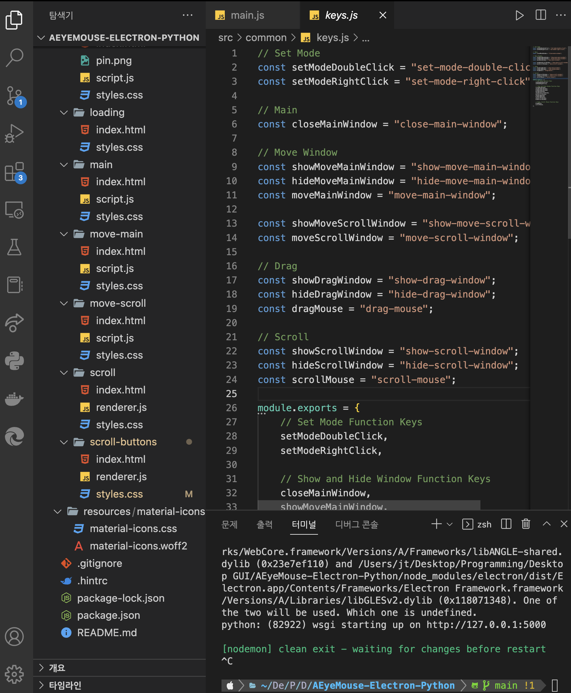
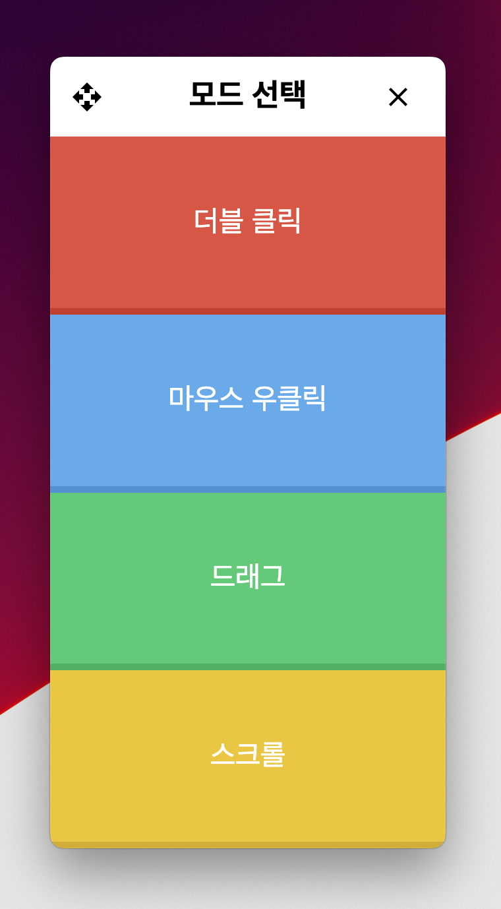
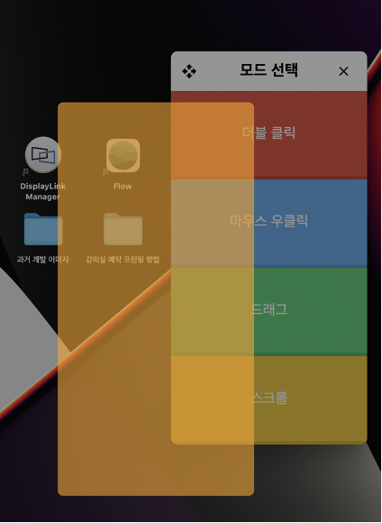
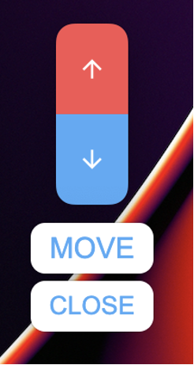
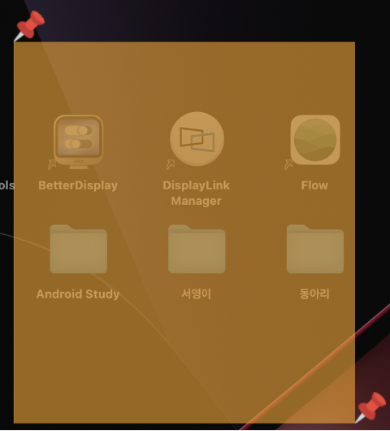

# 파란학기 GUI 프로젝트 문서

# 사용 기술

## UI Drawing

- `HTML` / `CSS` / `JavaScript` - 웹 프론트엔드 개발용 언어
    - Material Icons 프레임워크를 활용하여 UI 내 ↑와 같은 아이콘을 구현하였습니다.
    - 앱을 구현할 때 `React` / `Vue` / `Angular` / `Svelte`와 같은 `라이브러리 / 프레임워크`는 사용하지 않았습니다.
- [`Electron`](https://www.electronjs.org) - 웹 프론트엔드 기술로 데스크탑 앱을 개발하기 위한 프레임워크
    - Electron은 Windows OS, macOS, Linux를 지원하는 크로스 플랫폼 프레임워크입니다.
    - 구현한 앱이 Windows OS와 macOS에서 동작하는 것을 확인하였습니다.

## Mouse Control

- `Python`
    - 해당 앱은 Python의 `pyautogui` 라이브러리를 활용하여 마우스 컨트롤 기능을 동작시키고 있습니다.
    - 파이썬의 `socketio`와 `eventlet` 라이브러리를 활용해 Socket 서버를 생성하고 JavaScript와 통신합니다.
    - JavaScript에서 로컬 Socket 통신을 통해 함수 실행을 요청하면 해당 함수를 실행합니다. 예를 들어 JavaScript에서 `"drag-mouse"` 요청을 보내면 Python에서 `"drag-mouse"` 요청에 대응하는 함수를 실행합니다.

# 구현 방식

> GUI 파트에서 마우스 커서를 컨트롤 할 때에는 프로세스 간 통신(IPC) 방식을 통해 JavaScript 프로세스에서 Python 프로세스에 마우스 커서를 컨트롤하는 함수 실행을 요청하는 방식으로 동작합니다.

해당 GUI 앱은 총 세 가지 프로세스로 나눌 수 있습니다.

- GUI 파트의 Main Process
    - Main Process는 Node.js 기반으로 Node.js에서 사용하는 모든 모듈들을 사용할 수 있으며, Back-End의 영역에 속합니다.
- GUI 파트의 Renderer Process
    - Renderer Process는 HTML, CSS, JavaScript로 이루어지는 영역이며, Front-End 영역입니다.
- 마우스 커서(움직임, 클릭 등)를 컨트롤하는 Python Process
    - Python 언어로 실행되는 Process는 마우스 컨트롤과 관련된 기능을 수행하는 프로세스입니다. GUI 파트의 Main Process에서 요청을 받아 기능을 수행합니다.

IPC에 대한 자세한 내용은 공식 홈페이지 [Inter-Process Communication](https://www.electronjs.org/docs/latest/tutorial/ipc)을 참고하면 어떤 원리로 동작하는지 알 수 있습니다.

해당 내용이 어렵다면 Velog의 [[Electron] Electron의 IPC 통신 - ipcMain과 ipcRenderer](https://velog.io/@minidoo/Electron-Electron%EC%9D%98-IPC-%ED%86%B5%EC%8B%A0-ipcMain%EA%B3%BC-ipcRenderer) 또는 [[Electron] 일렉트론의 구조 / Main Process / Renderer Process](https://lifeinprogram.tistory.com/4) 링크의 내용이 도움이 될 수 있습니다.

그 외, 구글에 `Electron IPC`를 검색하면 블로그에서 적절한 자료를 찾을 수 있습니다.

# 구현한 기능 상세 내역

가운데 ~~줄이 그어진~~ 내용은 미완성인 기능입니다.

- 마우스 컨트롤
    - ~~더블 클릭~~
        - ~~기존의 하드웨어 클릭 기능이 더블 클릭으로 변경됩니다.~~
        - 하드웨어와 접목시켜 기능을 실행해보지 못해 코드만 작성하고 테스트하지 못하였습니다.
    - ~~마우스 우클릭~~
        - ~~기존의 하드웨어 클릭 기능이 마우스 우클릭으로 변경됩니다.~~
        - 하드웨어와 접목시켜 기능을 실행해보지 못해 코드만 작성하고 테스트하지 못하였습니다.
    - 드래그
        - 해당 소프트웨어의 드래그 버튼을 클릭하면 반투명한 창이 생성됩니다.
        - 해당 창 위에 마우스 클릭(또는 이와 동일한 역할을 하는 동작)을 통해 핀 2개를 찍고 해당 영역을 클릭하면 드래그 기능이 수행됩니다.
        - 핀 2개 바깥 영역을 클릭하면 드래그 기능이 취소됩니다.
    - 스크롤
        - 해당 소프트웨어의 스크롤 버튼을 클릭하면 Scroll Window가 나타납니다.
        - Scroll Window의 위 화살표 위에 마우스 커서를 위치시키면 위로 스크롤됩니다.
        - Scroll Window의 아래 화살표 위에 마우스 커서를 위치시키면 아래로 스크롤됩니다.
        - 마우스 커서와 Scroll Window가 스크롤 하고자 하는 소프트웨어 위(예를 들면 인터넷 브라우저 위)에 위치하지 않으면 스크롤 기능이 온전히 수행되지 않습니다.
        - Scroll Window의 위치를 변경하고 싶을 때에는 Move 버튼을 눌러 Window의 위치를 이동시킬 수 있습니다.

# 폴더 구조

- python - 파이썬 코드가 들어있는 폴더
- src - GUI 파트 코드가 들어있는 폴더
    - browser - Main Process 코드가 들어있는 폴더
    - common - Main Process와 Renderer 양쪽에서 사용할 수 있는 코드가 들어있는 폴더
    - renderer - Renderer Process 코드가 들어있는 폴더
    - resources - 아이콘, 이미지 파일 등이 들어있는 폴더

# 기능 구현 작업 시 사용한 IDE

해당 글 작성자는 [Visual Studio Code](https://code.visualstudio.com)로 작업하였습니다.

Visual Studio Code 이미지

# 완성된 GUI 모습

Main Window 이미지

Main Window 위치 조정 이미지

Scroll Window 이미지

Pin을 통해 드래그하는 이미지